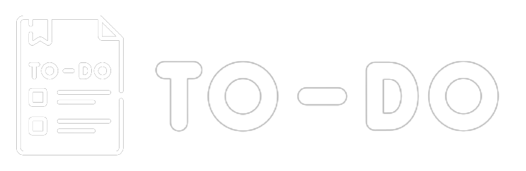

<h3 align="center">
    
    <br><br>
    <b>To Do List! Sua Tarefa em dia!</b>  
    <br>
</h3>

<div align="center">
  
[](https://br.linkedin.com/in/rafaeloliveiramartins)
[](https://www.instagram.com/rafaeloliveiramartins/)
[](https://www.facebook.com/rafaeloliveiramartinss/)
</div>

# Índice

- [Sobre](#sobre)
- [Documentação](#documentacao)
- [Tecnologias Utilizadas](#tecnologias-utilizadas)
- [Como Usar](#como-usar)
- [Melhorias](#melhorias)

<a id="sobre"></a>

## :bookmark: Sobre

O <strong>To Do List</strong> é uma aplicação Web, para ajudar pessoas a organizar suas tarefas diarias.

Essa aplicação foi construída com estudos obtidos na trilha base da <strong>Alura</strong> e com diversas fontes externas, não esquecendo dos principais <strong>You Tube e Google</strong> e também através de coloboração de diversas pessoas que solucionarão todas as minhas duvidas. A ideia de criar uma aplicação do zero a principio foi muito assustador porém com muitas tentativas <strong>se tornou possivel</strong>.

<a id="documentacao"></a>

## :books: Documentação

Para reforçar alguns conceitos e registrar comandos que são dificeis de se lembrar eu estou escrevendo uma pequena **[DOCUMENTAÇÃO](DOCUMENTATION.md)** para ajudar quem esta iniciando com **SQL Server**,**.NET**,**C#**,**Node**,**TypeScript**,**Angular** e **Angular Material**.

<a id="tecnologias-utilizadas"></a>

## :rocket: Tecnologias Utilizadas

O projeto foi desenvolvido utilizando as seguintes tecnologias

- [SQL Server](https://www.microsoft.com/pt-br/sql-server/sql-server-downloads)
- [.NET](https://dotnet.microsoft.com/en-us/)
- [C#](https://docs.microsoft.com/pt-br/dotnet/csharp/)
- [Node.js](https://nodejs.org/en/)
- [TypeScript](https://www.typescriptlang.org/)
- [Angular](https://angular.io/cli)
- [Angular Material](https://material.angular.io/)
- [Visual Studio](https://visualstudio.microsoft.com/pt-br/downloads/)
- [Visual Studio Code](https://code.visualstudio.com/)

## :heavy_check_mark: :computer: Resultado Web

- Para o design da página foi utilizado o **[Angular Material Componentes](https://material.angular.io/components/categories)**;

<h1 align="center">
    
</h1>

## :heavy_check_mark: :iphone: Resultado Mobile


   <div align="center">

    <br>

   
</div>
  


<a id="como-usar"></a>

## :fire: Como usar

- ### **Pré-requisitos**

  - É **necessário** possuir o **[Node.js](https://nodejs.org/en/)** instalado na máquina
  - Também, é **preciso** ter um gerenciador de pacotes pode ser o **[NPM](https://www.npmjs.com/)**.
  - Por fim, é **essencial** ter o **[Angular](https://angular.io/cli)** instalado de forma global na máquina.
  - Foi utilizado duas IDE para desenvolvimento, **[Visual Studio](https://visualstudio.microsoft.com/pt-br/downloads/)** e o **[Visual Studio Code](https://code.visualstudio.com/)**.

1. Faça um clone :

```sh
  $ git clone https://github.com/rafaeloliveiramartins/ToDo-Master.git
```

2. Executando a Aplicação:

```sh
  # Instale as dependências
  $ npm install

  ## Para executar o projeto

  Abra a solução do projeto

  $cd ToDoAPI

  execute

  ToDoAPI.sln

  ## Crie o banco de dados

  $ Add-Migration "CreateTableToDoDB"
  $ Update-Database

  # Inicie a API

  build started solution

  # Inicie a aplicação web
  $ cd ToDoApp
  $ npm start

  #acesse no navegador

  http://localhost:4200/

```

<a id="como-contribuir"></a>

## :recycle: Como contribuir

- Faça um Fork desse repositório,
- Crie uma branch com a sua feature: `git checkout -b my-feature`
- Commit suas mudanças: `git commit -m 'feat: My new feature'`
- Push a sua branch: `git push origin my-feature`

<a id="melhorias"></a>

## :mortar_board: Melhorias

Planos de melhorias, será necessário colocar um calendário **[Angular Calendar](https://www.syncfusion.com/angular-ui-components/angular-scheduler)**.

Como também implementar uma home e corrigir alguns defeitos de **User Experience**.

## :memo: Considerações Finais

Esse projeto foi desenvolvido por um desenvolvedor Jr, será necessário alguns ajustes para uma aplicação de produção.

---

<h4 align="center">
    Feito com 💜 by <a href="https://br.linkedin.com/in/rafaeloliveiramartins" target="_blank">Rafael Oliveira Martins</a>
</h4>
